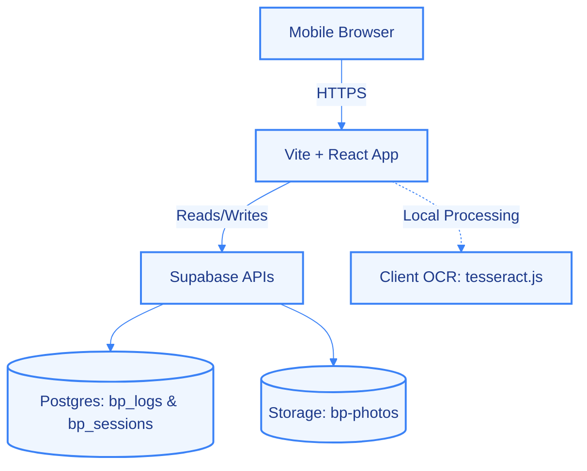
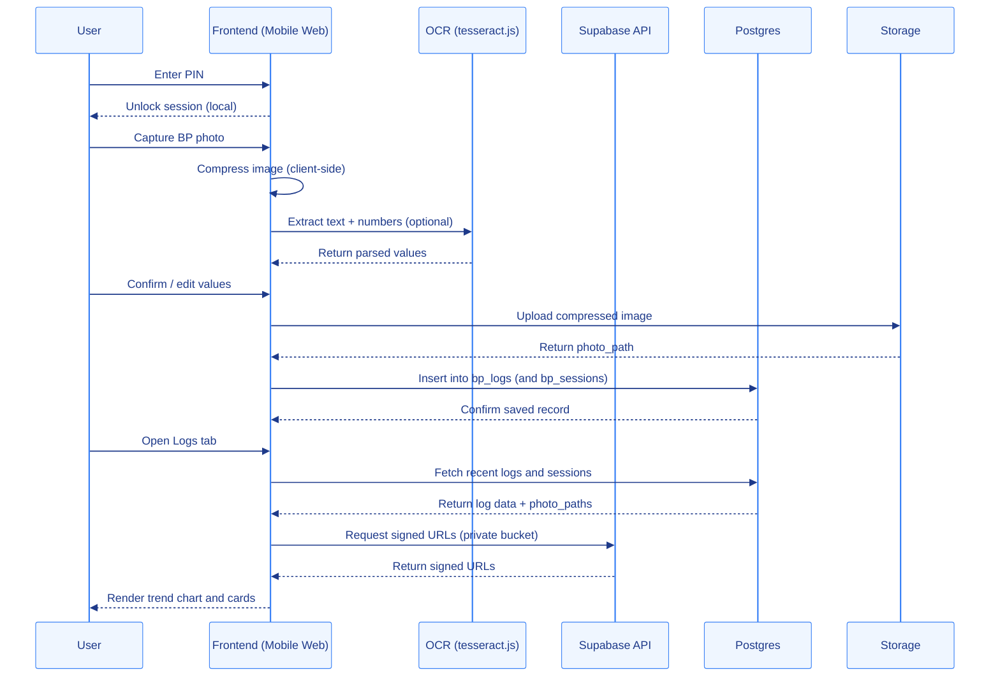
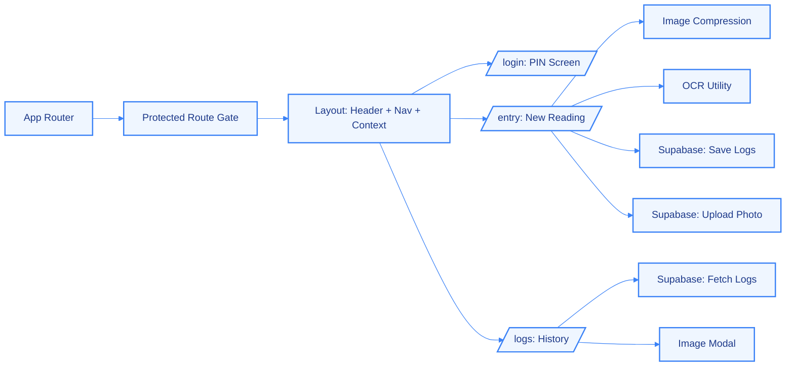
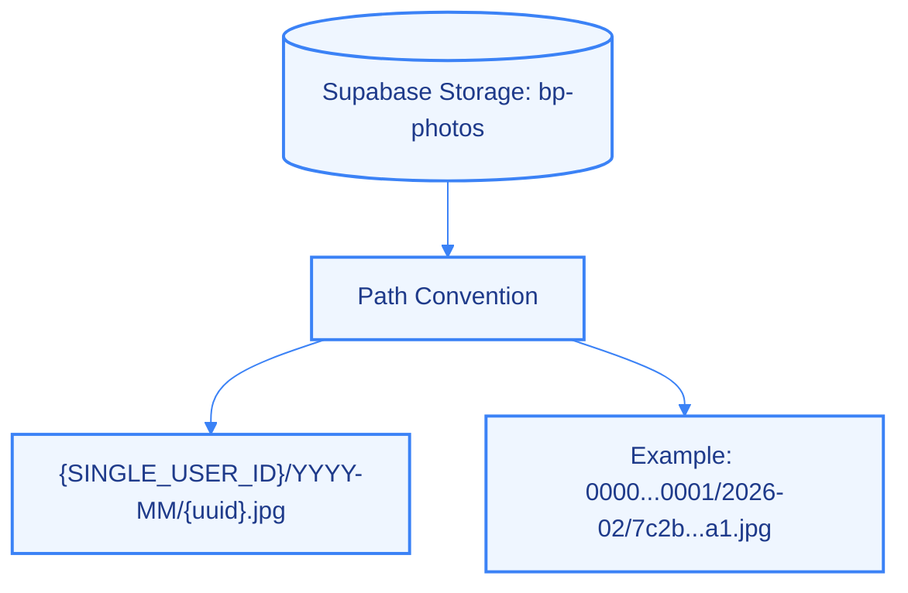
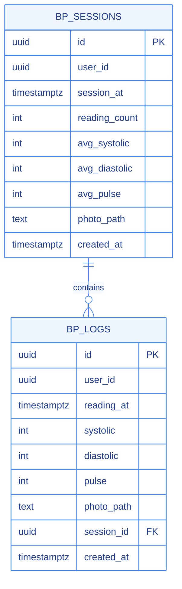
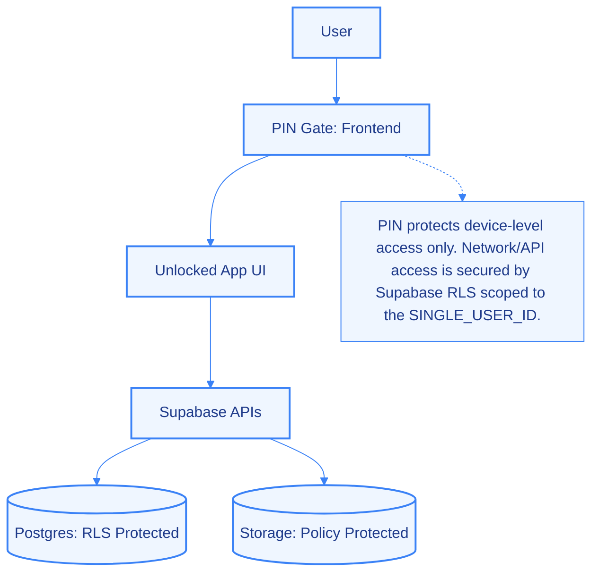

# Architecture

This document describes how the Blood Pressure Tracker is structured, how data flows, and what runs where.  
Diagrams use Mermaid with a single, consistent single-color scheme (blue) for clarity and readability.

---

## High-Level System

---

## Request and Data Flow

---

## Frontend Modules

---

## Storage Layout

---

## Database Model

---

## Security Boundary (PIN-based single user)

---

## Operational Notes

- OCR runs on-device in the browser; there is no OCR server.
- Images are compressed client-side and stored compressed in the bucket.
- Supabase is the only backend; no custom server is required.
- Logs use signed URLs for photos since the storage bucket is private.

