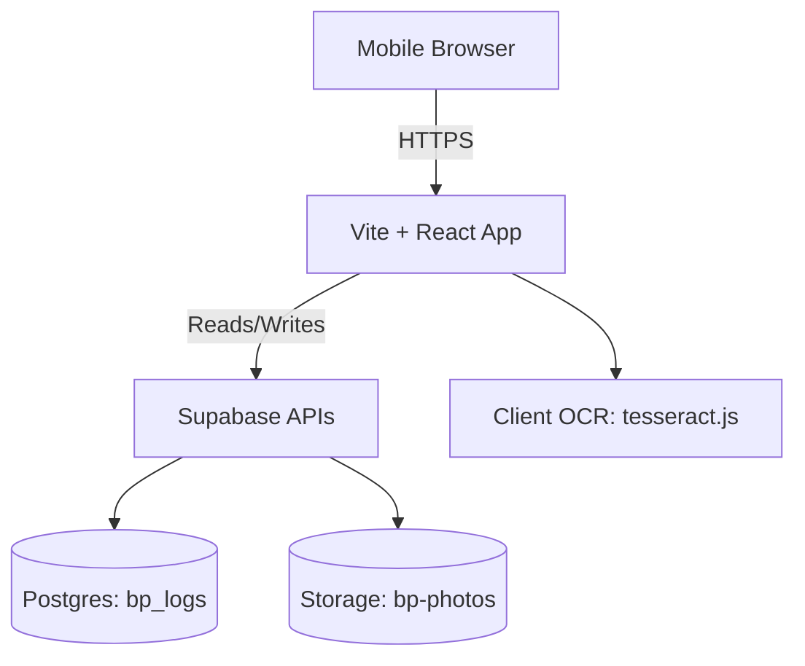
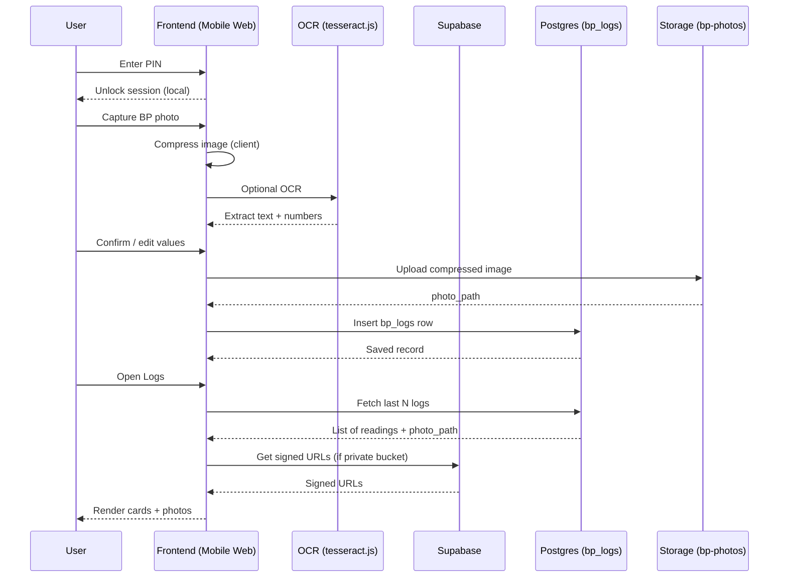
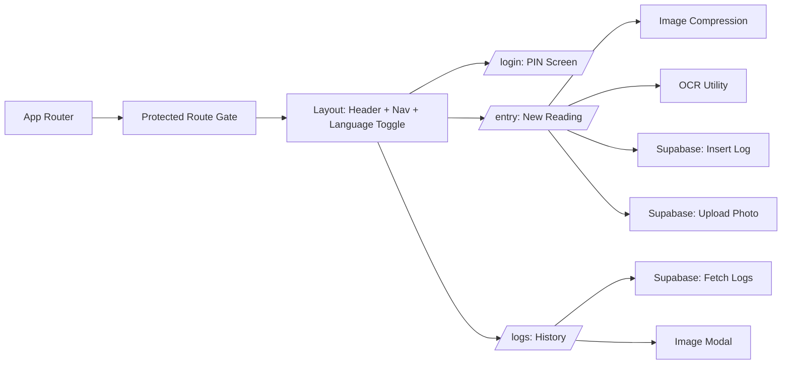
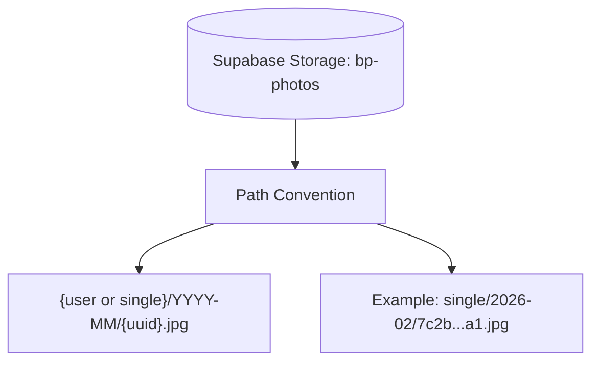
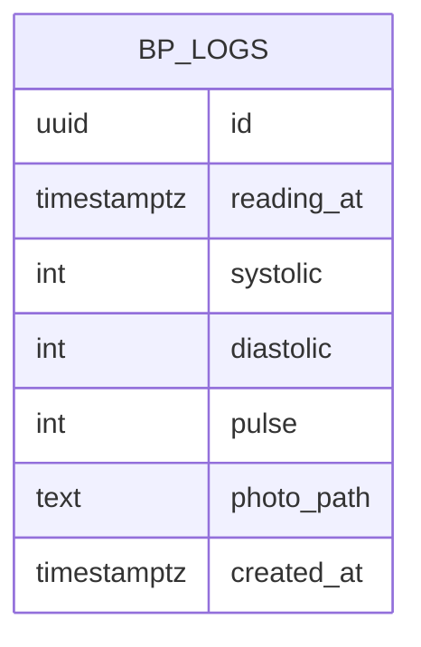

# Architecture

This document describes how the Blood Pressure Tracker is structured, how data flows, and what runs where.  
Diagrams use Mermaid with a single, consistent style.

---

## High-level system



---

## Request and data flow



---

## Frontend modules



---

## Storage layout



---

## Database model



---

## Security boundary (PIN-based single user)

```mermaid
flowchart TB
  U[User] --> PIN[PIN Gate (Frontend)]
  PIN --> UI[Unlocked App UI]
  UI --> SB[Supabase APIs]
  SB --> DB[(Postgres)]
  SB --> ST[(Storage)]

  note1[PIN protects device-level access only
Network/API access depends on Supabase rules]:::note
  PIN -.-> note1

  classDef note fill:#ffffff,stroke:#111827,stroke-width:1px,color:#111827;
```

---

## Operational notes

- OCR runs on-device in the browser; no OCR server.
- Images are compressed client-side and stored compressed.
- Supabase is the only backend; no Render or custom server required.
- If your bucket is private, Logs should use signed URLs for photos.

